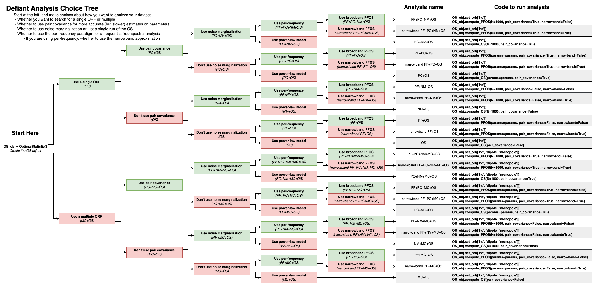

# defiant 

DEFIANT (Data-driven Enhanced Frequentist Inference Analysis with Next-gen Techniques) is a python package primarily aiming for robust, fast, and frequentist analysis of Pulsar Timing Array data using the PTA Optimal Statistic (OS). This package presents the parallel pipeline to the Bayesian PTA pipeline [ENTERPRISE](https://github.com/nanograv/enterprise). 

This package is primarily based on the work of the [PTA Optimal Statistic](https://arxiv.org/abs/0809.0701) and encorporates some coding techniques from the previous implementation in [enterprise_extensions/frequentist/optimal_statistic.py](https://github.com/nanograv/enterprise_extensions/blob/master/enterprise_extensions/frequentist/optimal_statistic.py) but encorporates the many expansions on the method developed since then. For details on what OS expansions this package supports, check the [Usage](#usage) section.

This code is still in its early stages, so if you have questions reach out to me!

## Installation

TODO: Make this package *conda* installable...

For now, there are two options for installation,

### Option 1: pip
The first option is to use ``pip+git``. For this method you **MUST** install ``ENTERPRISE`` through conda first. We recommend installing it with ``enterprise_extensions`` for its additional utility. Follow these steps. This has been verified to work in python versions: 3.9, 3.10, 3.11, 3.12. 

```bash
conda install -c conda-forge enterprise_extensions
pip install git+https://github.com/GersbachKa/defiant

# If you are using VScode for your notebooks, I reccomend you use https://pypi.org/project/vscode-tqdm/ 
# This fixes a bug in the rendering of notebooks. You will also need ipywidgets
pip install vscode-tqdm ipywidgets
```

Note: You may need to check which version of ``ENTERPRISE`` gets installed, as the tnequad definition change happened on version [v3.3.0](https://github.com/nanograv/enterprise/releases?page=1)

### Option 2: Clone and import

The other option, which is far more flexible, but can be a hassle is to clone the github, then add the cloned directory to your python path. You can do this in python with the following command:

```python
import sys
sys.path.append('<path-to-defiant>/')
from defiant import OptimalStatistic
```

## Example notebook

Speed, reproducability, and most important, documentation, are all primary concerns with the development of DEFIANT. Frustrated by the inadequate documentation from many packages in PTA science, DEFIANT attempts to be different by being overly documented and detailed in every component. As such, a ton of time and care have been put into developing examples for others to copy. The main resource (for now at least) for learning to use DEFIANT is in the notebooks section:

Specifically: [notebooks/many_examples.ipynb](https://github.com/GersbachKa/defiant/blob/main/notebooks/many_examples.ipynb)

Additionally, EVERY function and method have been rigorously commented such that if you have an IDE which shows doc-comments, you should be able to read exhastive descriptions for how to use each. If you find a flaw or an inadequate description, please raise an issue and it will be fixed ASAP!


## Usage

There are many ways in which you can use DEFIANT. Obviously, DEFIANT is specially built for the Optimal Statistic. This can be found in [defiant.OptimalStatistic](https://github.com/GersbachKa/defiant/blob/main/defiant/core.py) (or equivalently [defiant.core.OptimalStatistic](https://github.com/GersbachKa/defiant/blob/main/defiant/core.py)).

To use the OptimalStatistic, you must instance the object. There are 3 required parameters: 
1. '[psrs](https://github.com/GersbachKa/defiant/blob/main/defiant/core.py#L45)' -> The list of [enterprise.Pulsar]() objects
2. '[pta](https://github.com/GersbachKa/defiant/blob/main/defiant/core.py#L45)' -> The [enterprise.signals.signal_base.PTA]() object you wish to analyze 
3. '[gwb_name](https://github.com/GersbachKa/defiant/blob/main/defiant/core.py#L45)' -> A string corresponding to the name of the GWB parameters in the PTA.param_names*

*note that defiant assumes that you create PTAs in such a way that the parameters corresponding to the GWB are have names like `gwb_name + "_log10_A"` and `gwb_name + "_log10_A"`. By default '[gwb_name](https://github.com/GersbachKa/defiant/blob/main/defiant/core.py#L45)' is set to `"gw"`.

```python
# After defining psrs and pta
from defiant import OptimalStatistic
OS_obj = OptimalStatistic(psrs, pta, gwb_name='gw')
```

There are many optional parameters upon instancing which you can use to skip some additional steps, but for simplicity, we will show it in full. You will get a warning if you do not supply the Bayesian Common Uncorrelated Red Noise (CURN) MCMC chain in the initialization, but we can set it afterwards using the [OS_obj.set_chain_params()]() method. This method takes in parameters in many varieties of ways. Checking the documentation is the best way to find your favorite method. The easiest way is to supply a pre-made [la_forge.core.Core](https://github.com/nanograv/la_forge) object (check la_forge [documentation](https://la-forge.readthedocs.io/en/latest/tutorial1.html) for how to make a core from chain files). 

```python
# After instancing a la_forge core named lfcore
OS_obj.set_chain_params(core=lfcore)
```

Next and finally, we need to decide on which version of the Optimal Statistic you run. There are many options and they can all work together. If you want a fun, interactive way to figure out which version to run, check the [defiant.fun.what_kind_of_OS_are_you()](https://github.com/GersbachKa/defiant/blob/main/defiant/extra/fun.py) function! If you'd rather a less silly way, you can check the DEFIANT choice tree below:



Once you've decided on an OS version to run, check how to run that code using the choice tree or [what_kind_of_OS_are_you()](https://github.com/GersbachKa/defiant/blob/main/defiant/extra/fun.py) and run it! There are a few options that you might want to be aware of, specifically `return_pair_vals` which, if set to false, will not return pair-wise correlated values (the intermediate data products of the OS). This can be helpful in cases where you use noise marginalization and pair covariance as storing each covariance matrix can be memory expensive.
